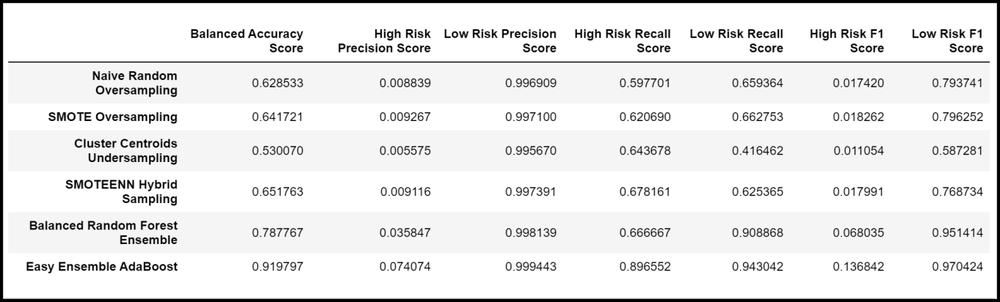

# Credit_Risk_Analysis
<!-- Using Python and Scikit-learn / imbalanced-learn library to build and evaluate several machine learning models to predict credit risk -->
## Project Background
LendingClub, a peer-to-peer (P2P) lending service, wants to use machine learning to predict credit risk, with the goals of:
- Providing faster & more reliable loan experience (i.e. attracting customers)
- More accurate identification of good loan candidates (i.e. decreasing defaults)
<!-- Peer-to-peer (P2P) lending is a form of financial technology that allows people to lend or borrow money from one another without going through a bank. -->
Since the number of good loans significantly exceeds the number of risky loans, imbalanced classification machine learning models will be considered.  LendingClub would like four resampling models and two ensemble models evaluated with their provided credit card credit dataset, as are outlined in [Methodology](#methodology).

## Purpose
<!-- The purpose of this analysis is well defined (4 pt) -->
This project is to train and evaluate the perfomance of six machine learning models for predicting credit risk.

## Resources
### Data Sources & Bespoke Code
1. [LoanStats_2019Q1.csv](Data/LoanStats_2019Q1.csv) [^1]
2. [credit_risk_resampling.ipynb](credit_risk_resampling.ipynb) [^2]
3. [credit_risk_ensemble.ipynb](credit_risk_ensemble.ipynb) [^2]

[^1]: 2019 Q1 Loan Data, provided by LendingClub  
[^2]: Jupyter Notebook

### Software & CDNs
***Table 1: Software & Library Versions***
| Software | Version |
| :--- | :---: |
| Python | 3.7.13 |
| Pandas | 1.3.5 |
| NumPy | 1.21.5 |
| SciPy | 1.7.3 |
| Scikit-learn | 1.0.2 |
| imbalanced-learn | 0.9.0 |
| Visual Studio Code | 1.70.2 |

# Results 
<!-- There is a bulleted list that describes the balanced accuracy score and the precision and recall scores of all six machine learning models (15 pt) -->
## Methodology
The machine learning models evaluated are listed in **Table 1**.

***Table 2: Classification Models for Evaluation***
| Case | Algorithm | Sampling Type |
| :---: | :---: | :---: |
| 1 | RandomOverSampler | Oversampling Minority |
| 2 | SMOTE | Oversampling Minority |
| 3 | ClusterCentroids | Undersampling Majority |
| 4 | SMOTEENN | Combinatorial / Hybrid | 
| 5 | BalancedRandomForestClassifier | Ensemble |
| 6 | EasyEnsembleClassifier | Ensemble |

**Note:** A random state of 1 is used for each sampling algorithm to ensure consistency between tests

### Resampling Models
The four resampling models (Cases 1-4 in **Table 1**) were analyzed using the Jupyter Notebook code [credit_risk_resampling.ipynb](credit_risk_resampling.ipynb).  The client's dataset was loaded into a dataframe, cleaned, and split along the following parameters:
- Target values were in the column "loan_status"
- Features values were converted from strings to numbers using the `get_dummies()` method, excluding the columns:
  - Text columns - "home_ownership", "verification_status", "initial_list_status", "application_type"
  - Date columns - "issue_d", "next_pymnt_d"
  - Boolean / "Y/N" columns - "pymnt_plan", "hardship_flag", "debt_settlement_flag"

Each resampling algorithm was then run with the folliowing steps:
1. Resample data with algorithm & view the count of the target classes using `Counter` from the collections library. 
2. Train a logistic regression model with the resampled data.
3. Calculate the balanced accuracy score from sklearn.metrics.
4. Print the confusion matrix from sklearn.metrics.
5. Generate a classication report using the `imbalanced_classification_report` from imbalanced-learn.

A summary of the metrics for each model was then exported to [Resampling_Summary.csv](Data/Resampling_Summary.csv).

### Ensemble Models
The two ensemble models (Cases 5-6 in **Table 1**) were analyzed using the Jupyter Notebook code [credit_risk_ensemble.ipynb](credit_risk_ensemble.ipynb).  The client's dataset was loaded into a dataframe, cleaned, and split exactly as was done for the resampling models.  Additionally, the summary file [Resampling_Summary.csv](Data/Resampling_Summary.csv) was imported in order to be appended to.

Similarly to resampling models, each ensemble algorithm was then run with the folliowing steps:
1. Train a logistic regression model with the split data.
3. Calculate the balanced accuracy score from sklearn.metrics.
4. Print the confusion matrix from sklearn.metrics.
5. Generate a classication report using the `imbalanced_classification_report` from imbalanced-learn.

For the Balanced Random Forest Classifier, the feature importance were also sorted in descending order (most important feature to least important) along with the feature score.

## Comparison of Model Performance
Comparison of the six machine learning models showed:

***Table 3: Machine Learning Model Perfomance***

From ***Table 3***, it can be concluded:
- The accuracy scores for the resampling models are not particularly strong.  The Easy Ensemble Classifier may be bordering on overfitting
- The incredibly low F1 scores and precision scores indicate none of the models are particularly good at identifying high credit risk.
- The F1 and precision scores for the model identifying low credit risk are not good for the undersampling model, and the very high scores for the ensemble models may indicate overfitting.

# Summary 
<!-- There is a summary of the results (2 pt) -->
<!-- There is a recommendation on which model to use, or there is no recommendation with a justification (3 pt) -->
None of the models are particularly good at identifying high credit risk, based on the incredibly low F1 and precision scores.  Since accurately identifying high risk loans is a primary goal, it is not recommended to use the models as trained.  However, using more than a single fiscal quarter's worth of data for training may yield better results.  It is recommended to retrain the models with at least an entire year's worth of data.
